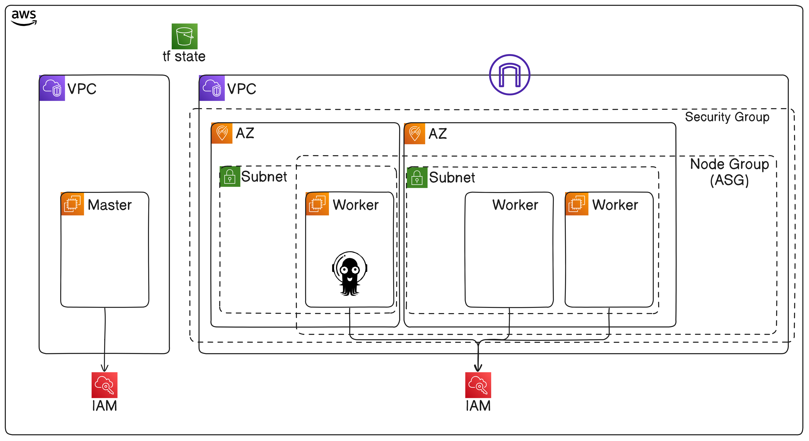

# Terraform Project: EKS Cluster with ArgoCD

This project uses Terraform to provision an Amazon EKS (Elastic Kubernetes Service) cluster and deploy ArgoCD for continuous deployment management. The infrastructure is organized into modules to ensure modularity and reusability. The key modules in this project include EKS, IAM, Security Groups (SG), VPC, and ArgoCD.

## Project Structure
```
├── modules/
  │
  ├── argo/
  │
  ├── eks/
  │
  ├── iam/
  │
  ├── security_group/
  │
  └── vpc/
├── tfvars/
  └── terraform.tfvars
├── main.tf
├── outputs.tf
├── providers.tf
├── README.md
└── variables.tf
```

## Project Architecture


### Modules

1. **eks/**: This module provisions the EKS cluster, including node groups, cluster configuration, and adds-on.

2. **iam/**: This module handles IAM roles, policies, and permissions necessary for the EKS cluster and ArgoCD.

3. **sg/**: This module defines the security groups required for securing the EKS cluster.

4. **vpc/**: This module creates a VPC with the required subnets, route tables, and internet gateways for the EKS cluster.

5. **argo/**: This module installs and configures ArgoCD on the EKS cluster for managing continuous deployment workflows.

## Prerequisites

- [Terraform](https://www.terraform.io/downloads.html) installed on your machine.
- An existing AWS account.
- AWS CLI configured with appropriate permissions.
- S3 bucket configured for state management (<bucket_name>).

## Getting Started

### 1. Clone the Repository

  ```
    git clone https://gitlab.com/portfolio_eliyahu/terraform-eks.git
    cd terraform-eks
  ```

### 2. Change the providers.tf to point to you bucket

  ```
    backend "s3" {
      bucket = <bucket_name>
      key    = "cluster.state"
      region = <your_region>
    }
  ```

### 3. Initialize Terraform
  Before applying the Terraform configuration, initialize the project by downloading the necessary provider plugins and modules:
  ```
    terraform init
  ```

### 4. Customize Variables
  Create the tfvars/prod.tfvars file to customize the deployment. You can use the tfvars/tfvars.example.

### 5. Apply the Configuration
  ```
    terraform apply -f tfvars/prod.tfvars
  ```
  Read carefully the provisioned plan and agree with it.

### 6. Update the path of kubeconfig
  ```
    aws eks update-kubeconfig --name <cluster_name> --region <your_region>
  ```

### 7. Get your admin password for Argo
  ```
    kubectl -n argocd get secret argocd-initial-admin-secret -o jsonpath="{.data.password}" | base64 -d
  ```

### 8. Access ArgoCD
  Once the deployment is complete, you can access ArgoCD by forwarding the service to a local port:
  ```
    kubectl port-forward svc/argocd-server -n argocd 8080:443
  ```

### 9. Access Grafana:
  ```
    kubectl port-forward svc/kube-prometheus-stack-grafana 3000:80 -n monitoring
  ```

### 10. Get password for Grafana:
  ```
    kubectl get secret kube-prometheus-stack-grafana -o jsonpath="{.data.admin-password}" -n monitoring | base64 --decode
  ```
  (prom-operator by default)

### 11. Access Prometheus:
  ```
    kubectl port-forward -n monitoring svc/kube-prometheus-stack-prometheus 9090:9090
  ```
  And took at 'Targets' if you get your app's metrics.

### 12. Access Kibana:
  ```
    kubectl port-forward svc/kibana-kibana 5601:5601 -n logging
  ```

### 13. Get elasticsearch password:
  ```
    kubectl get secret elasticsearch-master-credentials -n logging -o yaml
  ```
  And then decode it using:
  ```
    echo "<base64-encoded-password>" | base64 --decode